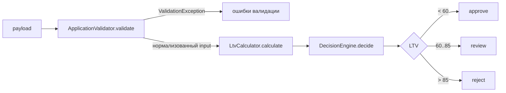

# Карта кода: расчёт решения approve / review / reject

Дата: 2026-09-24
Область: `backend/src/Domain/`, `backend/config/rules.php`

## Участники

| Файл | Роль |
|---|---|
| `backend/src/Domain/AssessmentService.php` | Оркестратор: валидация → LTV → решение |
| `backend/src/Domain/ApplicationValidator.php` | Проверка входных полей по `config/rules.php` |
| `backend/src/Domain/VinValidator.php` | Формальная проверка VIN (длина 17, A-Z0-9, без I/O/Q) |
| `backend/src/Domain/VehicleAge.php` | Возраст авто = текущий год − год выпуска |
| `backend/src/Domain/LtvCalculator.php` | LTV = requested_amount / market_value × 100 (round до 2 знаков) |
| `backend/src/Domain/DecisionEngine.php` | Пороги approve/review/reject по LTV |
| `backend/src/Domain/ValidationException.php` | Носитель ошибок валидации (поле → сообщение) |
| `backend/config/rules.php` | Все бизнес-числа: VIN, год/возраст/пробег, сумма, срок, пороги LTV |

## Порядок вызова

Всё начинается в `AssessmentService::assess()` (`AssessmentService.php:28`):

1. `ApplicationValidator::validate($payload)` — нормализует и проверяет поля по `rules.php`:
   - VIN через `VinValidator::isValid` (правила `rules.vin`)
   - год: не раньше `vehicle.min_year` (1990), не в будущем,
     возраст не больше `vehicle.max_age_years` (20) — возраст через `VehicleAge::inYears`
   - пробег: `0 <= mileage <= vehicle.max_mileage_km` (500 000)
   - `market_value > 0`, сумма в диапазоне `amount.min..max`,
     срок в `term.min_months..max_months`
   - при любой ошибке — `throw ValidationException`, заявка до расчёта
     решения не доходит
2. `LtvCalculator::calculate($requestedAmount, $marketValue)` — LTV в процентах
   с двумя знаками.
3. `DecisionEngine::decide($ltv)` (`DecisionEngine.php:30`):
   - `LTV < approve_max` (60.0) → `approve`
   - `LTV <= review_max` (85.0) → `review`
   - иначе → `reject`

   Примечание: код проверяет `<` для approve, а комментарии в
   `DecisionEngine.php` и `rules.php` пишут `<=` — расхождение на границе 60.0.
4. Формирование ответа `assess()`: `vehicle_age`, `ltv`, `decision`,
   `approved_limit` (запрошенная сумма при approve, иначе 0).
   Расчёт лимита по `rules.ltv_by_age` не реализован (задача LOAN-12).

## Куда встанет правило «пробег ≤ 400 000 км, иначе review»

- **Место:** `AssessmentService::assess` — после
  `$decision = $this->decisionEngine->decide($ltv)` (`AssessmentService.php:33`),
  перед формированием массива результата. Если
  `$input['mileage'] > 400000`, решение меняется на `DecisionEngine::REVIEW`.
  Открытый вопрос: приоритет с `reject` (понижать ли reject до review —
  уточнить у автора задачи).
- **Почему не `ApplicationValidator`:** там пробег уже занят жёсткой границей
  `vehicle.max_mileage_km = 500000` (за пределами — `ValidationException`),
  а новое правило — мягкое понижение решения, а не ошибка.
- **Почему не `DecisionEngine::decide`:** метод принимает только `float $ltv`
  и про пробег не знает; расширение сигнатуры возможно, но инвазивнее.

### Входные данные

Есть:
- `$input['mileage']` — валидированное `int` в диапазоне 0..500 000
  (поле `mileage` в пейлоаде, нормализуется в `ApplicationValidator`).

Не хватает:
- порога 400 000 в `backend/config/rules.php` — есть только
  `vehicle.max_mileage_km = 500000`; нужен новый ключ
  (например, `vehicle.review_mileage_km`), числа не хардкодим;
- передачи конфига `rules.php` в `AssessmentService` — сейчас конструктор
  получает только валидатор, калькулятор, движок и `VehicleAge`;
- тестов на новое поведение — нет.

## Что уже проверяется про пробег

Только одно: `ApplicationValidator::validate` (`ApplicationValidator.php:43-46`) —
`mileage` должен быть целым от 0 до `rules['vehicle']['max_mileage_km']`
(500 000 из `rules.php`). Нарушение → ошибка валидации
«Пробег от 0 до 500000 км». На решение (approve/review/reject) пробег сейчас
не влияет: в `DecisionEngine` и `LtvCalculator` пробег не передаётся
и нигде не используется. Больше проверок пробега в коде нет.
